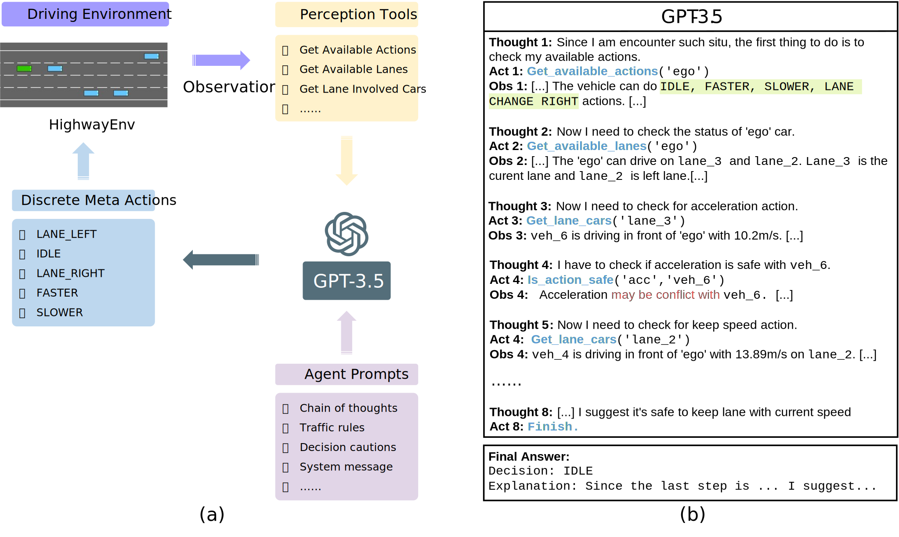

# Drive Like A Human
Drive Like a Human: Rethinking Autonomous Driving with Large Language Models

## Closed-loop interaction ability in driving scenarios

https://github.com/PJLab-ADG/DriveLikeAHuman/assets/18390668/0ec8e901-9dc1-4c89-81d6-994309a49630

## Reasoning ability with common sense

Try it with your own image in [this notebook](CaseReasoning.ipynb)!

## Performance enhancement through memorization ability

<!-- ## Cite -->

## Acknowledgments

We would like to thank the authors and developers of the following projects, this project is built upon these great open-sourced projects.
- [highway-env](https://github.com/Farama-Foundation/HighwayEnv)
- [LangChain](https://github.com/hwchase17/langchain)
- [LLaMA-Adapter](https://github.com/OpenGVLab/LLaMA-Adapter)

## Contact

- If you have any questions, please:
  - Send email to fudaocheng@pjlab.org.cn .
  - Report issues on GitHub [Preferred] .
  - For other coorperation possibilities, please contact shibotian@pjlab.org.cn .